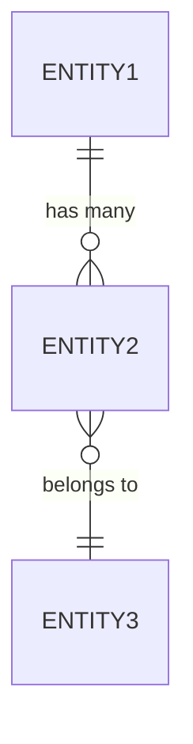

# Create Feature Specification

Create a comprehensive PRD-style specification document for $ARGUMENTS following Spring Boot microservices architecture patterns.

## What This Command Creates

Creates a Product Requirements Document with:

- Product overview and business context
- Features and functional requirements
- Data models and entity relationships
- API contracts and endpoint specifications
- Technical architecture decisions
- Non-functional requirements
- Success criteria

## Process

### 1. Get Current Date

Retrieves current date for specification documentation using a shell command.

### 2. Determine Next Specification Number

Search `docs/specifications/` directory for existing specs with matching project prefix:
- Find highest number: `SPEC-{PROJECT}-XXX-*.md`
- Increment by 1 for new specification

### 3. Check for Existing ADRs

If ADR files exist in `docs/architecture/`:
- Read relevant ADRs for architecture context
- Reference established patterns and decisions
- Align technical approach with ADRs

### 4. Ask Clarifying Questions

**IMPORTANT**: Only ask questions about genuinely unclear aspects. Do NOT ask about:
- Information already provided in the command
- Established patterns from CLAUDE.md
- Standard Spring Boot patterns from reference codebase

**Before writing ANY specification:**
- Review feature requirements
- Identify missing technical details
- Understand scope and boundaries
- Use lettered questions (a, b, c) with numbered answers (1, 2, 3)
- Wait for user responses before proceeding

### 5. Create Specification Document

- Create spec in `docs/specifications/` directory
- Follow PRD template structure
- Include all required sections
- Reference existing ADRs where applicable

## Specification Structure

### File Location

- **Directory**: `docs/specifications/`
- **File**: `SPEC-{PROJECT}-{NUM}-{kebab-case-name}.md`
- **Example**: `docs/specifications/SPEC-UCRM-001-order-management.md`

### Specification Template

```markdown
# Feature Specification: {Feature Name}

**Specification ID**: SPEC-{PROJECT}-{NUM}
**Created**: {Date}
**Status**: Draft | Approved | Implemented

## Executive Summary

Brief 2-3 sentence overview of what this feature does and why it's needed.

## Business Context

### Problem Statement

What business problem does this feature solve?

### Target Users

Who will use this feature? (Internal users, external customers, system administrators, etc.)

### Business Value

What value does this deliver? (Revenue impact, cost savings, efficiency gains, etc.)

## Functional Requirements

### Feature Overview

Comprehensive description of the feature and its capabilities.

### Core Features

1. **Feature 1**
   - Description
   - User benefit
   - Priority: High | Medium | Low

2. **Feature 2**
   - Description
   - User benefit
   - Priority: High | Medium | Low

### User Workflows

Describe the typical user flows through the feature using step-by-step narratives.

## Data Models

### Entities

#### {EntityName}

**Table**: `{table_name}`

| Field | Type | Constraints | Description |
|-------|------|-------------|-------------|
| id | UUID | PK | Unique identifier |
| name | VARCHAR(255) | NOT NULL | Entity name |
| status | VARCHAR(50) | NOT NULL | Current status (ACTIVE, INACTIVE) |
| created_at | TIMESTAMP | NOT NULL | Creation timestamp |
| updated_at | TIMESTAMP | NOT NULL | Last update timestamp |

**Indexes**:
- `idx_{table}_status` on `status`
- `idx_{table}_created_at` on `created_at`

**Relationships**:
- Belongs to `Parent` (many-to-one)
- Has many `Children` (one-to-many)

### Entity Relationships Diagram



## API Contracts

### Endpoints

#### Create {Resource}

**Endpoint**: `POST /api/v1/{resources}`

**Request Body**:
```json
{
  "name": "Example",
  "description": "Example description",
  "type": "TYPE_A"
}
```

**Response** (201 Created):
```json
{
  "id": "550e8400-e29b-41d4-a716-446655440000",
  "name": "Example",
  "status": "ACTIVE",
  "createdAt": "2025-01-15T10:30:00Z"
}
```

**Error Responses**:
- `400 Bad Request`: Invalid input (validation errors)
- `409 Conflict`: Resource already exists
- `500 Internal Server Error`: Server error

#### Get {Resource}

**Endpoint**: `GET /api/v1/{resources}/{id}`

**Response** (200 OK):
```json
{
  "id": "550e8400-e29b-41d4-a716-446655440000",
  "name": "Example",
  "status": "ACTIVE",
  "createdAt": "2025-01-15T10:30:00Z"
}
```

**Error Responses**:
- `404 Not Found`: Resource doesn't exist

### OpenAPI Documentation

All endpoints must be documented with OpenAPI/Swagger annotations:
- `@Operation` with summary and description
- `@ApiResponse` for all response codes
- `@Schema` for all DTOs
- `@Parameter` for all request parameters

## Technical Architecture

### Layer Responsibilities

#### Persistence Layer

**Entities**:
- `{Entity}.java` - JPA entity with `@EmbeddedId`, `Persistable<ID>`
- `{Entity}Id.java` - Composite ID class
- `{Entity}Status.java` - Status enum

**Repositories**:
- `{Entity}Repository.java` - Spring Data JPA repository
- `{Entity}BatchRepository.java` - Custom batch operations

**Liquibase**:
- `{TICKET}-create-{table}.xml` - Schema creation
- `{TICKET}-add-{columns}.xml` - Schema modifications

#### Domain Layer

**Facades**:
- `{Feature}Facade.java` - Business logic orchestration
- `{Feature}Configuration.java` - `@Bean` factory methods

**Services**:
- `{Feature}Service.java` - Helper services (if needed)
- `{Feature}Metrics.java` - Micrometer metrics

**Exceptions**:
- `Retryable{Feature}Exception.java` - Transient failures
- `NonRetryable{Feature}Exception.java` - Permanent failures

#### API Layer

**Controllers**:
- `{Feature}Controller.java` - REST endpoints with OpenAPI

**DTOs**:
- `Create{Resource}Request.java` - Input validation
- `{Resource}Response.java` - Output representation

**HTTP Files**:
- `http/{Feature}Controller/{methodName}.http` - Manual testing

### Architecture Decisions

Reference existing ADRs or create new ones:
- ADR-XXX: {Decision Title}
- Rationale: {Why this approach}
- Alternatives Considered: {Other options}

### Technology Stack

- **Language**: Java 21
- **Framework**: Spring Boot 3.x
- **Database**: PostgreSQL with Liquibase
- **Testing**: Spock Framework (Groovy)
- **Documentation**: OpenAPI/Swagger
- **Metrics**: Micrometer
- **Build**: Gradle with Kotlin DSL

## Non-Functional Requirements

### Performance

- API response time: < 200ms (95th percentile)
- Database queries: Indexed for common access patterns
- Batch operations: Process 10,000 records in < 5 seconds

### Scalability

- Horizontal scaling: Stateless design
- Database: Partitioned tables for time-series data
- Concurrent processing: `SELECT FOR UPDATE SKIP LOCKED`

### Security

- Authentication: Service-to-service via JWT
- Authorization: Role-based access control
- Input Validation: Jakarta Bean Validation
- SQL Injection: Parameterized queries only

### Observability

- Logging: SLF4J with structured logging (JSON)
- Metrics: Micrometer counters and timers
- Tracing: MDC context propagation
- Alerts: Based on error rates and latency

### Reliability

- Transaction Management: `@Transactional` at facade level
- Error Handling: Retryable vs Non-Retryable exceptions
- Idempotency: Unique constraints and idempotency keys
- Data Consistency: ACID transactions via JPA

## Success Criteria

### Functional Acceptance

- [ ] All user workflows complete successfully
- [ ] All validation rules enforced
- [ ] All error cases handled gracefully

### Technical Acceptance

- [ ] All ArchUnit rules pass (`./gradlew check`)
- [ ] All Spock tests pass with > 80% coverage
- [ ] All endpoints have `.http` files
- [ ] OpenAPI documentation complete

### Performance Acceptance

- [ ] API response times meet SLA
- [ ] Database queries use indexes
- [ ] No N+1 query problems

## Stories to Create

> **Story boundary rule**: Each story must represent a **user-facing, demonstrable increment of value** — something an operator or calling service can actually use once it is shipped.
>
> **Do NOT split by technical layer.** Persistence → domain → REST → tests is an implementation sequence that belongs in the *plan phases*, not in separate stories. A story that delivers only a repository method or only a facade, with no working API endpoint, is a task, not a story.
>
> **Split into multiple stories only when there is a meaningful business distinction**, for example:
> - A core feature vs. an optional enhancement (e.g. JSON API vs. CSV export)
> - Genuinely separable user workflows that can each be shipped and used independently
> - A feature so large it cannot be delivered in one sprint
>
> When in doubt, **default to one story per specification**. If the spec is small enough that all functionality can be shipped together, one story is correct.

This specification will be broken down into the following stories:

1. **{PROJECT}-001**: {Story Title}
   - Scope: {Brief description — must describe user-facing functionality, not a technical layer}
   - Estimate: {Complexity}

2. **{PROJECT}-002**: {Story Title}
   - Scope: {Brief description — must describe user-facing functionality, not a technical layer}
   - Estimate: {Complexity}

## Dependencies

### External Systems

- {System Name}: {What we need from it}
- {API Name}: {Endpoints we'll call}

### Shared Libraries

- `@example/common-lib`: {What we'll use}
- `@example/auth-lib`: {What we'll use}

### Infrastructure

- Database: PostgreSQL 15+
- Message Queue: Pub/Sub (if async processing needed)
- Cache: Redis (if caching needed)

## Risks and Mitigation

| Risk | Impact | Probability | Mitigation |
|------|--------|-------------|------------|
| Database migration fails | High | Low | Test migrations locally, use Liquibase rollback |
| Performance issues | Medium | Medium | Load testing, indexed queries, monitoring |
| Integration failures | High | Low | Circuit breakers, retry logic, fallback behavior |

## Timeline Estimate

This is a rough complexity estimate, not a deadline:

- Specification Review: {X days}
- Story Creation: {X days}
- Implementation: {X weeks}
- Testing & QA: {X days}
- Deployment: {X days}

## Appendix

### Glossary

- **Term 1**: Definition
- **Term 2**: Definition

### References

- ADR-XXX: {Link to related ADR}
- Existing Feature: {Link to similar implementation}
- External Documentation: {Link to third-party docs}
```

## Example Specification

````markdown
# Feature Specification: Order Management System

**Specification ID**: SPEC-UCRM-001
**Created**: 2025-01-15
**Status**: Draft

## Executive Summary

The Order Management System enables customers to create, track, and manage orders through a REST API. This feature provides the foundation for the e-commerce workflow and integrates with inventory and payment systems.

## Business Context

### Problem Statement

Currently, orders are created manually through admin tools, leading to:
- High operational overhead
- Delayed order processing
- Poor customer experience
- Limited scalability

### Target Users

- **External**: E-commerce customers creating orders via web/mobile app
- **Internal**: Customer service representatives managing orders

### Business Value

- Reduce order processing time by 80%
- Enable self-service customer ordering
- Scale to 10,000+ orders per day
- Improve order accuracy through validation

## Functional Requirements

### Feature Overview

The Order Management System provides REST APIs for creating, reading, updating, and canceling orders. It enforces business rules for order validation, inventory allocation, and payment processing.

### Core Features

1. **Create Order**
   - Accept order details (items, quantities, shipping address)
   - Validate inventory availability
   - Calculate order total with taxes
   - Priority: High

2. **View Order**
   - Retrieve order details by ID
   - Show current status and history
   - Priority: High

3. **Cancel Order**
   - Cancel order before shipment
   - Restore inventory allocation
   - Priority: Medium

### User Workflows

**Customer creates an order:**
1. Customer selects products and adds to cart
2. Customer proceeds to checkout
3. System validates inventory for all items
4. System calculates total with shipping and tax
5. System creates order in PENDING status
6. Customer receives order confirmation with ID

## Data Models

### Entities

#### Order

**Table**: `orders`

| Field | Type | Constraints | Description |
|-------|------|-------------|-------------|
| id | UUID | PK | Unique order identifier |
| order_date | DATE | NOT NULL, PK (partition key) | Order creation date |
| customer_id | VARCHAR(255) | NOT NULL | Customer identifier |
| status | VARCHAR(50) | NOT NULL | Order status (PENDING, CONFIRMED, SHIPPED, DELIVERED, CANCELLED) |
| total_amount | DECIMAL(19,4) | NOT NULL | Total order amount |
| currency | VARCHAR(3) | NOT NULL | Currency code (EUR, USD) |
| shipping_address | TEXT | NOT NULL | JSON shipping address |
| created_at | TIMESTAMP | NOT NULL | Creation timestamp |
| updated_at | TIMESTAMP | NOT NULL | Last update timestamp |
| version | INTEGER | NOT NULL | Optimistic locking version |

**Indexes**:
- `idx_orders_customer_id` on `customer_id`
- `idx_orders_status` on `status`
- `idx_orders_created_at` on `created_at`

**Partitioning**: Range partitioned by `order_date`

#### OrderItem

**Table**: `order_items`

| Field | Type | Constraints | Description |
|-------|------|-------------|-------------|
| id | UUID | PK | Unique item identifier |
| order_id | UUID | FK, NOT NULL | Order reference |
| product_id | VARCHAR(255) | NOT NULL | Product identifier |
| quantity | INTEGER | NOT NULL | Item quantity |
| unit_price | DECIMAL(19,4) | NOT NULL | Price per unit |
| total_price | DECIMAL(19,4) | NOT NULL | Total for this item |

## API Contracts

### Create Order

**Endpoint**: `POST /api/v1/orders`

**Request Body**:
```json
{
  "customerId": "cust-123",
  "items": [
    {
      "productId": "prod-456",
      "quantity": 2
    }
  ],
  "shippingAddress": {
    "street": "123 Main St",
    "city": "Warsaw",
    "postalCode": "00-001",
    "country": "PL"
  }
}
```

**Response** (201 Created):
```json
{
  "id": "550e8400-e29b-41d4-a716-446655440000",
  "orderDate": "2025-01-15",
  "customerId": "cust-123",
  "status": "PENDING",
  "totalAmount": 299.99,
  "currency": "EUR",
  "items": [
    {
      "productId": "prod-456",
      "quantity": 2,
      "unitPrice": 149.99,
      "totalPrice": 299.98
    }
  ],
  "createdAt": "2025-01-15T10:30:00Z"
}
```

## Technical Architecture

### Layer Responsibilities

#### Persistence Layer
- `Order.java`, `OrderId.java`, `OrderStatus.java`
- `OrderRepository.java` - Spring Data JPA
- `UCRM-001-create-orders-table.xml` - Liquibase

#### Domain Layer
- `OrderFacade.java` - Order business logic
- `OrderConfiguration.java` - Bean factory
- `OrderMetrics.java` - Micrometer metrics
- `RetryableOrderException.java`, `NonRetryableOrderException.java`

#### API Layer
- `OrderController.java` - REST endpoints
- `CreateOrderRequest.java`, `OrderResponse.java`
- `http/OrderController/*.http` - Test files

## Non-Functional Requirements

### Performance
- Order creation: < 200ms (95th percentile)
- Order retrieval: < 50ms (95th percentile)

### Security
- JWT authentication required
- Customer can only access their own orders

### Reliability
- Transactional order creation (atomic)
- Idempotent order creation (prevent duplicates)

## Success Criteria

- [ ] All ArchUnit rules pass
- [ ] All Spock tests pass with 80% coverage
- [ ] OpenAPI documentation complete
- [ ] .http files for all endpoints

## Stories to Create

1. **UCRM-001**: Order management — create, retrieve, and cancel orders
   - Scope: Full working REST API for order lifecycle (POST, GET, DELETE endpoints) including persistence, business logic, validations, and component tests
   - Estimate: M

> Note: The above is **one story** even though it touches persistence, domain, and API layers. Those layers are phases in the implementation plan. A story for "just the Order entity" or "just the OrderRepository" would not be a deliverable — no user can use a repository method on its own.
````

## After Specification Creation

- Specification is created but stories aren't generated automatically
- Use `/story` command to create individual stories
- Each story references the parent specification
- Multiple stories can be created from one specification

## Usage Examples

```
/spec UCRM "Order Management System"

Create a specification for managing customer orders including creation, retrieval, and cancellation.
```

```
/spec UCRM "Inventory Tracking"

Create a specification for tracking product inventory levels with real-time updates and low-stock alerts.
```

```
/spec UCRM "Payment Processing Integration"

Create a specification for integrating with external payment gateway for order payments.
```
